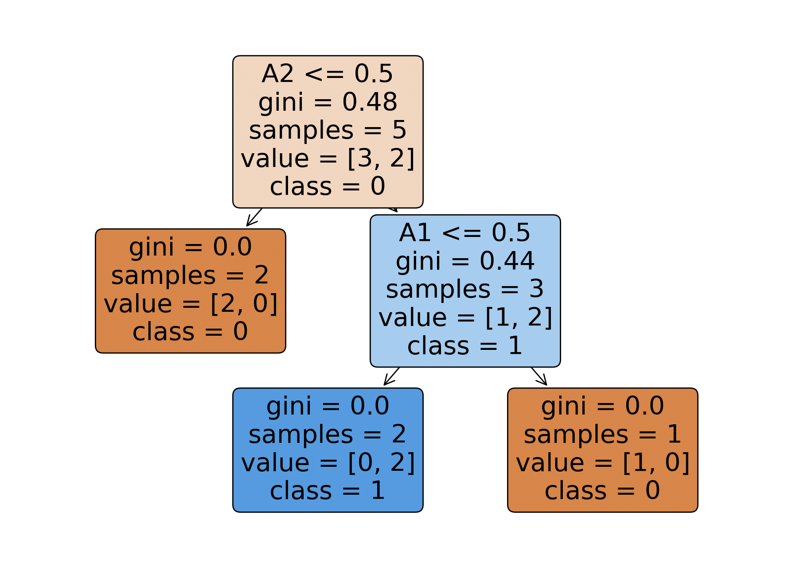
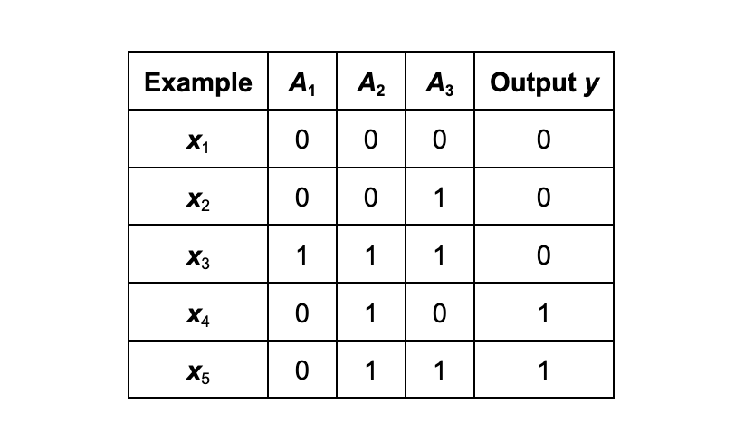

# Decision Tree Learning

This repository contains a Python script for learning a decision tree using the LEARN-DECISION-TREE algorithm. The script utilizes the `scikit-learn` library to create a Decision Tree Classifier and visualizes the resulting decision tree.


**Digital Growth: The Binary Tree of Decisions**

This vibrant image depicts a tree that symbolizes the concept of "Decision Tree Learning" in a visually compelling way. The trunk and branches are rendered in a spectrum of warm colors, representing the various paths and choices in a decision process. The leaves are replaced by an array of digital binary codes in cool hues, suggesting data points and the binary decisions made at each node of the tree. The background of cascading raining binary digits in vertical streams evokes the flow of information and the algorithms that run behind the scenes of machine learning. Overall, the artwork captures the intersection of organic decision-making and digital data processing, a hallmark of decision tree algorithms in artificial intelligence.

## Repository Contents

* `decision_tree_learning.py`: The main Python script for learning a decision tree.
* `README.md`: Documentation providing an overview of the repository and instructions.

## Getting Started

Follow these steps to get started with the decision tree learning script:

Follow these steps to get started with the decision tree learning script:

1. **Clone the Repository:**

```bash
git clone https://github.com/abelxmendoza/Decision-Tree-Learning.git
```

2. **Navigate to the Repository:**

```bash
cd Decision-Tree-Learning
```

**3. Run the Script:**

```bash
python3 decision_tree_learning.py
```

This will execute the script, create a decision tree, and display a graphical representation of the tree.

## Visualization

The decision tree is visualized using the `plot_tree` function from `scikit-learn`. The graphical representation shows decision nodes, leaf nodes, and conditions based on features.



## Dataset

The script uses a simple dataset with binary input attributes (A1, A2, A3) and a binary output (Output y).



## Contributions

Contributions are welcome! If you have suggestions, improvements, or feature requests, feel free to open an issue or submit a pull request.

## Acknowledgment

Special thanks to Professor Kenytt Avery at California State University Fullerton for the guidance on the exercise.

## License

This project is licensed under the MIT License - see the [LICENSE](https://chat.openai.com/c/LICENSE) file for details.

## Documentations

Assignment Submission:
[https://docs.google.com/document/d/1h4M-IueEFTKt-olsMWisFFHuS9oMp9TwNNQRK9h1DY0/edit?usp=sharing]()

Assignment Guideline:

[https://docs.google.com/document/d/1yRi3DX3ymrS2gjkOO1dWZOXBvU4ZVZsEWDbd8jfUnlk/edit?usp=sharing](https://docs.google.com/document/d/1yRi3DX3ymrS2gjkOO1dWZOXBvU4ZVZsEWDbd8jfUnlk/edit?usp=sharing)
